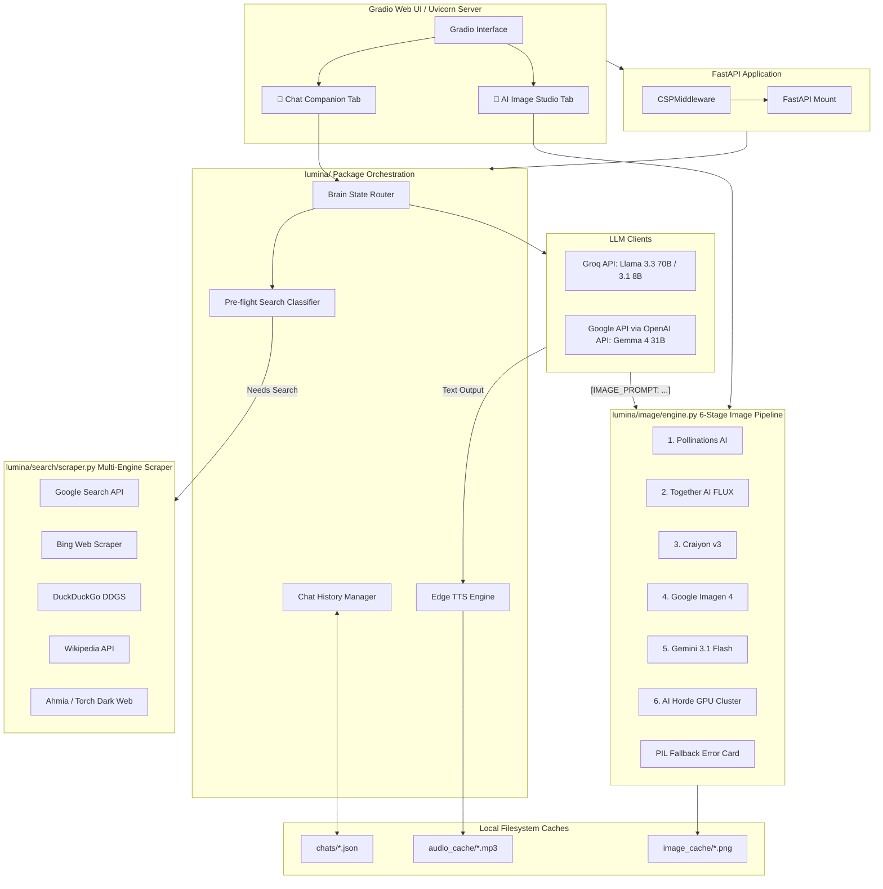
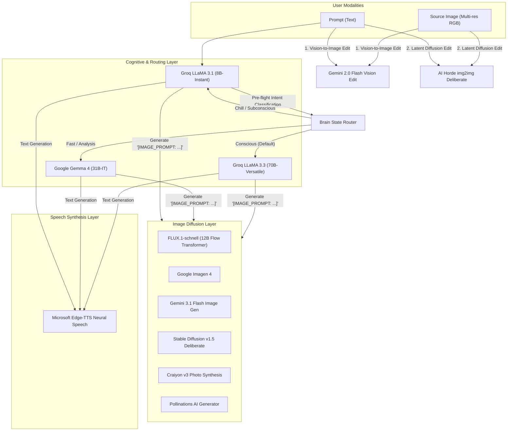
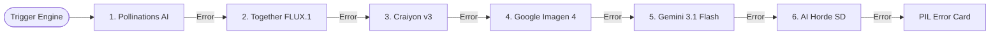

# 🏛️ Architecture

## 💡 Engineering Paradigm: Agile AI Platform Engineering

Lumina AI is closest to **Agile AI Platform Engineering** combined with **DevOps + LLMOps + Architecture-Driven Development**.

And honestly? That’s how many modern AI startups and platform teams increasingly operate. Rather than treating AI engineering as simple API integrations or isolated model research, Lumina approaches it as a cohesive platform engineering discipline where stability, fast iteration, architecture records, and adaptive routing are first-class citizens.

### 🔄 The Intersection of Four Disciplines

The platform's operational model sits at the intersection of:
- **DevOps**: Ensuring containerized environment parity, automated testing, high availability, reverse proxy WebSocket upgrades, and automated CI/CD releases.
- **LLMOps**: Managing prompt templates, dynamic model parameter routing, real-time fallback cascades, and model latency metrics.
- **Architecture-Driven Development**: Grounding the codebase in modular API contracts, clear separation of concerns, and historical ADRs (Architecture Decision Records) to guide design choices.
- **Agile AI**: Collecting telemetry, evaluating classifier drift, and executing rapid optimization feedback loops.

The diagram below illustrates how these pillars combine to build Lumina's platform framework:

```mermaid
flowchart TD
    subgraph Platform ["Agile AI Platform Engineering"]
        subgraph DevOps ["1. DevOps Core"]
            CI["CI/CD Pipelines"]
            Docker["Containerization (Docker)"]
            Proxy["Reverse Proxy (Nginx)"]
        end

        subgraph LLMOps ["2. LLMOps & AIOps"]
            Routing["Dynamic LLM Routing"]
            Fallback["6-Stage Failover Cascade"]
            PromptEng["Prompt Versioning & Tuning"]
        end

        subgraph ADD ["3. Architecture-Driven Development"]
            ADRs["Architecture Decision Records (ADRs)"]
            Contracts["Strict API JSON Contracts"]
            Modular["Modular Subsystem Boundaries"]
        end

        subgraph AgileAI ["4. Agile Execution"]
            Feedback["Telemetry Feedback Loop"]
            Iterative["Rapid Integration & Testing"]
            Telemetry["Real-time User Analytics"]
        end

        DevOps <--> LLMOps
        LLMOps <--> ADD
        ADD <--> AgileAI
        AgileAI <--> DevOps
    end

    style Platform fill:#12141a,stroke:#343a40,stroke-width:2px,color:#fff
    style DevOps fill:#1e222b,stroke:#00bcd4,color:#fff
    style LLMOps fill:#1e222b,stroke:#e91e63,color:#fff
    style ADD fill:#1e222b,stroke:#9c27b0,color:#fff
    style AgileAI fill:#1e222b,stroke:#4caf50,color:#fff
```



---

## 🏛️ System Architecture & Data Flow

Lumina AI is structured as a modular, asynchronous web application built on top of **FastAPI**, **Uvicorn**, and **Gradio**. It orchestrates multiple external APIs and local scraping subsystems to deliver seamless conversational and generative experiences.



## 💾 Memory Persistence Design

Chat history in Lumina is designed to be persistent, portable, and fault-tolerant.

### History Serialization (`history.py`)
All conversations are saved as JSON blobs in the `chats/` directory.

- **Data Structure**:
```json
{
  "id": "uuid4",
  "title": "Explain quantum physics...",
  "updated_at": "2026-05-22 14:30",
  "history": [
    {"role": "user", "content": "Explain quantum physics"},
    {"role": "assistant", "content": "Quantum physics is..."}
  ]
}
```

### Auto-Titling and Flattening
- **Title Generation**: `save_chat()` automatically extracts the very first user message, converts it to a string, and truncates it to 30 characters to dynamically name the chat session in the UI sidebar.
- **Robust Parsing**: Gradio 4+ occasionally returns history as tuples (`(user_msg, bot_msg)`) or nested `FileData` dictionaries (when users upload images). The `extract_text_content()` recursive helper flattens these complex structures into clean strings before they are serialized to JSON or sent to the TTS engine.

## 📊 Comprehensive Architectural Diagrams

The following diagrams illustrate the high-level interactions, the internal orchestration, the complete request lifecycle, and the production deployment architecture of Lumina AI.

### 1. System-Wide Use Case Diagram
This diagram illustrates the primary actions a human user can take and how those actions connect to the autonomous orchestration handled by the Lumina Backend Core.


## 🧠 Neural Network & Model Architecture

Lumina AI implements a hybrid, multi-modal neural network orchestration stack designed to optimize reasoning fidelity, response latency, operation cost, and high availability. Rather than executing a single local model with massive compute requirements, Lumina distributes inference workloads across specialized cloud-hosted LLM clusters, decentralized diffusion pipelines, and neural text-to-speech synthesis networks.

The system partitions workloads across three main neural layers:
1. **Cognitive Reasoning Layer** (Text-to-Text & Tool Routing)
2. **Visual Synthesis Layer** (Text-to-Image & Multimodal img2img)
3. **Acoustic Synthesis Layer** (Text-to-Speech)

### 📊 Model Orchestration & Modality Flow

The following diagram maps out how different inputs and modalities flow through Lumina's dynamic neural routing architecture:



---

### 1. Cognitive Reasoning Layer (LLMs)

Lumina delegates text processing, intent classification, and character-driven response generation using a 5-tier dynamic routing configuration:

| Model Name | API Provider | Parameters | Attention / Architecture Features | Context Window | Operational Role |
|---|---|---|---|---|---|
| **LLaMA 3.3 70B** | Groq | 70 Billion | Grouped-Query Attention (GQA), Rotary Position Embeddings (RoPE) | 128,000 tokens | **Conscious (Default)** mode. Primary cognitive engine. Used for complex coding, logical reasoning, and creative writing. |
| **Gemma 4 31B** | Google (OpenAI-compatible) | 31 Billion | Multi-Query Attention, GeGLU activation, RoPE | 8,192 tokens | **Fast & Deep Analysis** modes. High-speed reasoning, deep reading, and document research. |
| **LLaMA 3.1 8B** | Groq | 8 Billion | Grouped-Query Attention (GQA), RoPE | 128,000 tokens | **Chill & Subconscious** modes. Lightweight conversational partner, pre-flight search intent classification. |

#### Pre-flight Intent Classification (`classifier.py`)
To prevent wasting high-tier tokens, Lumina routes incoming messages to a lightweight classifier model (`L31` or `G4` depending on the current mode). This model evaluates the prompt and the last two chat history turns using a few-shot JSON formatting schema to output:
```json
{
  "needs_search": true,
  "query": "search query text",
  "type": "text"
}
```
If `needs_search` is true, the system performs external scraping before sending the concatenated context to the primary generative model.

---

### 2. Visual Synthesis Layer (Text-to-Image & Edit)

When the cognitive layer emits an `[IMAGE_PROMPT: ...]` command, the image subsystem invokes a **6-stage cascade** to synthesize images, falling back sequentially if rate limits or outages are encountered.



#### Text-to-Image Model Parameters:
- **FLUX.1-schnell**: A 12-billion parameter rectified flow transformer model developed by Black Forest Labs. It is optimized for high-fidelity prompt adherence, realistic text rendering, and rapid 4-step generation.
- **Google Imagen 4**: Google's text-to-image diffusion model, specializing in high-fidelity compositions, realistic lighting, and text generation.
- **Stable Diffusion v1.5 (Deliberate)**: Fine-tuned weight configuration run on crowdsourced GPU nodes, utilizing a traditional UNet latent diffusion architecture.

#### Vision-Conditioned Image Editing (img2img):
When editing an uploaded image, the system utilizes a **3-stage editing cascade**:
1. **Gemini Multimodal Vision (`gemini-2.0-flash-preview-image-generation`)**: Integrates visual features from the base64-encoded input image directly into the model's multimodal cross-attention layers alongside the textual instruction to synthesize a new edited image.
2. **AI Horde img2img (Stable Diffusion Deliberate)**: Runs standard image-to-image latent diffusion. The source image is encoded into latent space, noise is added based on a `denoising_strength=0.65` parameter, and the UNet is run to denoise the latents based on the edit prompt.
3. **PIL Native Overlay**: A non-neural fallback that draws a semi-transparent banner containing the edit description on top of the original image.

---

### 3. Acoustic Synthesis Layer (Neural TTS)

Lumina converts generated text into verbal responses using a deep learning text-to-speech network:

- **Microsoft Edge-TTS Engine**: Synthesizes natural-sounding speech from text strings. It leverages deep neural networks (DNN) trained on extensive voice datasets. By default, it employs `en-GB-SoniaNeural`, which models human prosody, inflection, and British regional pronunciation.
- **Preprocessing & Sanitization (`tts.py`)**: A custom regex pipeline cleans the LLM output before speech generation. It strips markdown blocks, system-only formatting, URLs, and code blocks, preventing the neural TTS engine from pronouncing raw markdown or HTML tags.


