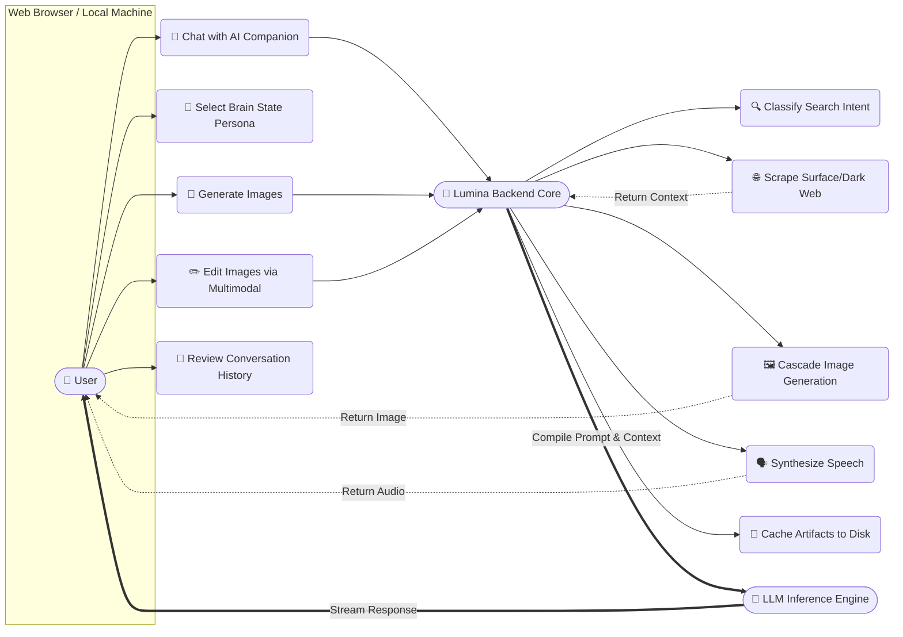
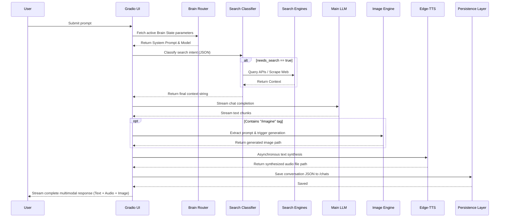

# 🏛️ Architecture

## 🏛️ System Architecture & Data Flow

Lumina AI is structured as a modular, asynchronous web application built on top of **FastAPI**, **Uvicorn**, and **Gradio**. It orchestrates multiple external APIs and local scraping subsystems to deliver seamless conversational and generative experiences.

```mermaid
flowchart TD
    subgraph Frontend [Gradio Web UI / Uvicorn Server]
        UI[Gradio Interface]
        ChatTab[💬 Chat Companion Tab]
        StudioTab[🎨 AI Image Studio Tab]
        UI --> ChatTab
        UI --> StudioTab
    end

    subgraph Middleware [FastAPI Application]
        CSP[CSPMiddleware]
        FastAPI[FastAPI Mount]
        CSP --> FastAPI
    end

    subgraph CoreBackend [lumina/ Package Orchestration]
        Router[Brain State Router]
        Preflight[Pre-flight Search Classifier]
        History[Chat History Manager]
        TTS[Edge TTS Engine]
    end

    subgraph ExternalLLMs [LLM Clients]
        Groq[Groq API: Llama 3.3 70B / 3.1 8B]
        Gemma[Google API via OpenAI API: Gemma 4 31B]
    end

    subgraph ScraperSubsystem [lumina/search/scraper.py Multi-Engine Scraper]
        Google[Google Search API]
        Bing[Bing Web Scraper]
        DDG[DuckDuckGo DDGS]
        Wiki[Wikipedia API]
        Ahmia[Ahmia / Torch Dark Web]
    end

    subgraph ImageSubsystem [lumina/image/engine.py 6-Stage Image Pipeline]
        Img1[1. Pollinations AI]
        Img2[2. Together AI FLUX]
        Img3[3. Craiyon v3]
        Img4[4. Google Imagen 4]
        Img5[5. Gemini 3.1 Flash]
        Img6[6. AI Horde GPU Cluster]
        PIL[PIL Fallback Error Card]
    end

    subgraph Storage [Local Filesystem Caches]
        ChatStore[chats/*.json]
        AudioStore[audio_cache/*.mp3]
        ImageStore[image_cache/*.png]
    end

    Frontend --> Middleware
    Middleware --> CoreBackend
    ChatTab --> Router
    StudioTab --> ImageSubsystem
    Router --> Preflight
    Preflight -- Needs Search --> ScraperSubsystem
    Router --> ExternalLLMs
    ExternalLLMs -- [IMAGE_PROMPT: ...] --> ImageSubsystem
    ExternalLLMs -- Text Output --> TTS
    History <--> ChatStore
    TTS --> AudioStore
    ImageSubsystem --> ImageStore
```



## 💾 Memory Persistence Design

Chat history in Lumina is designed to be persistent, portable, and fault-tolerant.

### History Serialization (`history.py`)
All conversations are saved as JSON blobs in the `chats/` directory.

- **Data Structure**:
```json
{
  "id": "uuid4",
  "title": "Explain quantum physics...",
  "updated_at": "2026-05-22 14:30",
  "history": [
    {"role": "user", "content": "Explain quantum physics"},
    {"role": "assistant", "content": "Quantum physics is..."}
  ]
}
```

### Auto-Titling and Flattening
- **Title Generation**: `save_chat()` automatically extracts the very first user message, converts it to a string, and truncates it to 30 characters to dynamically name the chat session in the UI sidebar.
- **Robust Parsing**: Gradio 4+ occasionally returns history as tuples (`(user_msg, bot_msg)`) or nested `FileData` dictionaries (when users upload images). The `extract_text_content()` recursive helper flattens these complex structures into clean strings before they are serialized to JSON or sent to the TTS engine.

## 📊 Comprehensive Architectural Diagrams

The following diagrams illustrate the high-level interactions, the internal orchestration, the complete request lifecycle, and the production deployment architecture of Lumina AI.

### 1. System-Wide Use Case Diagram
This diagram illustrates the primary actions a human user can take and how those actions connect to the autonomous orchestration handled by the Lumina Backend Core.



### 3. The Chat Request Lifecycle (Sequence Diagram)
A highly detailed, end-to-end sequence illustrating how a single user prompt triggers a massive orchestration of search scraping, LLM streaming, image generation, audio synthesis, and memory persistence.



