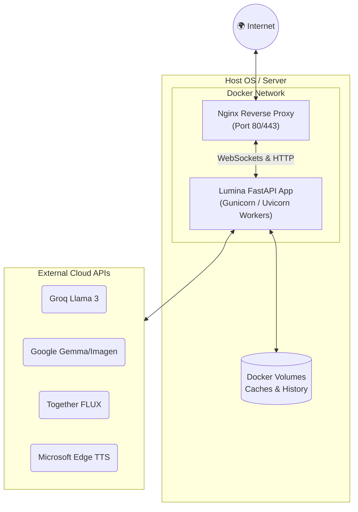

# 🚀 Deployment & Infrastructure


Lumina includes a fully containerized production infrastructure utilizing Docker, Gunicorn, and Nginx.

**Infrastructure Components:**
- **Dockerfile**: Builds a lightweight Python 3.11 image and installs all dependencies.
- **Production Server**: Uses **Gunicorn** with asynchronous **Uvicorn** workers to handle high-concurrency requests and robust application scaling.
- **Reverse Proxy (Nginx)**: The included `nginx/nginx.conf` securely routes traffic to the backend on port 80, explicitly handling WebSocket upgrades required by Gradio.
- **docker-compose.yml**: Orchestrates the Nginx reverse proxy and the Lumina Python backend, automatically mounting persistent volumes for image and audio caches.
- **Environment Separation**:
  - `.env.dev`: Local development environment variables template.
  - `.env.prod`: Production environment variables explicitly loaded by Docker Compose.

**Deployment Steps:**
1. Populate `.env.prod` with your real API keys.
2. Run the following command to build the image and spin up the backend and reverse proxy in the background:

```bash
docker-compose up -d --build
```
3. Access the application on `http://<your-server-ip>/`.

---
Illustrates the production-ready Docker infrastructure, showcasing how traffic hits the reverse proxy before being distributed to Uvicorn workers.


