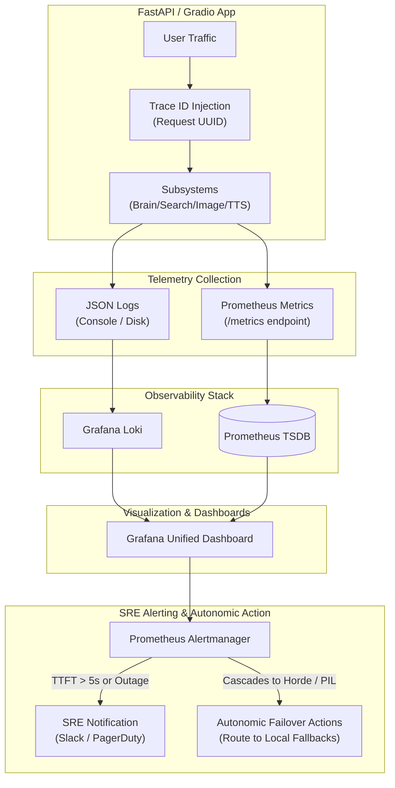

# 🔭 Observability Strategy

As Lumina AI orchestrates increasingly complex asynchronous tasks (LLM Routing, Web Scraping, 6-Stage Image Cascades), robust observability is critical for debugging and performance tuning.

## 1. Logging Strategy
We utilize Python's standard `logging` library, heavily augmented for async contexts.
- **Format**: All production logs are serialized to JSON. This allows logs to be easily ingested and queried by systems like ELK (Elasticsearch, Logstash, Kibana) or Grafana Loki.
- **Trace IDs**: Every incoming chat request is assigned a unique `UUID`. This Trace ID is passed down through the `BrainRouter`, `SearchClassifier`, and `ImageEngine` to easily track a single user journey across multiple async threads.

## 2. Distributed Tracing
Because Lumina relies heavily on external Cloud APIs, we implement basic span tracking:
- **LLM Latency**: Time to First Token (TTFT) and Total Generation Time are measured for both Groq and Google endpoints.
- **Failover Cascades**: When `generate_image_async` cascades from Provider 1 to Provider 2, an `WARN` level trace is emitted indicating *why* the failover occurred (e.g., HTTP 429 Rate Limit vs HTTP 500 Internal Error).

## 3. Core Metrics & Monitoring
The FastAPI middleware exposes a `/metrics` endpoint (Prometheus format) tracking:
- `lumina_search_timeouts_total`: Number of times the DDG/Google scraper timed out.
- `lumina_image_generation_duration_seconds`: Histogram of image pipeline latency.
- `lumina_tts_generation_errors`: Counter for Edge-TTS websocket disconnects.
- `lumina_active_websocket_connections`: Gauge tracking active Gradio users.

## 4. Alerting
Alerts should be configured if:
- The Pre-flight Search Classifier begins returning non-JSON formats repeatedly (indicating a prompt injection or LLM drift).
- Image Generation reaches Stage 6 (AI Horde) or the PIL Fallback more than 5 times in a 10-minute window (indicating upstream provider outages).

## 5. SRE Observability & Alerting Feedback Loop

To maintain the high availability (99.9% uptime target) of Lumina's distributed components, we deploy an integrated Site Reliability Engineering (SRE) feedback and alerting loop. This ensures that response degradation, token streaming latency spikes, web scraping failures, and API authentication timeouts are instantly caught, reported, and managed.

The following flowchart details the SRE feedback loop from live user traffic telemetry collection down to autonomic local failover actions:

