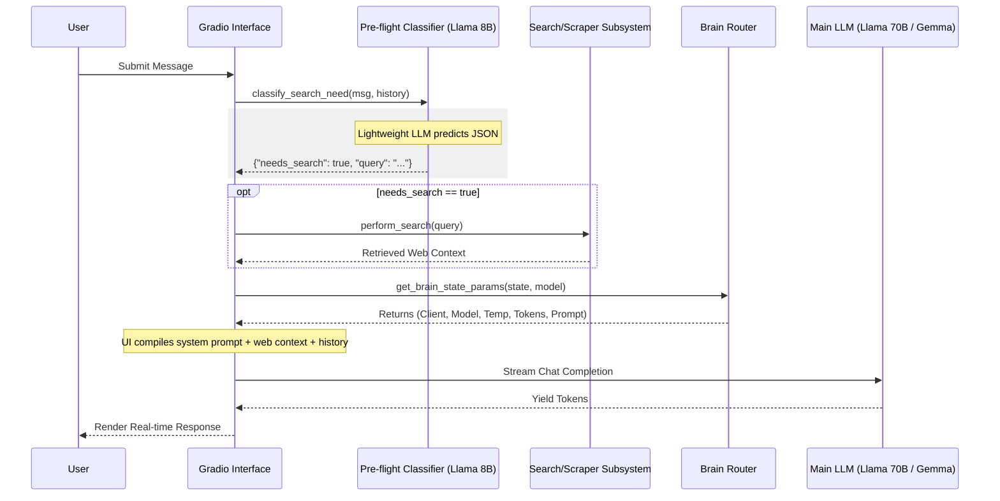
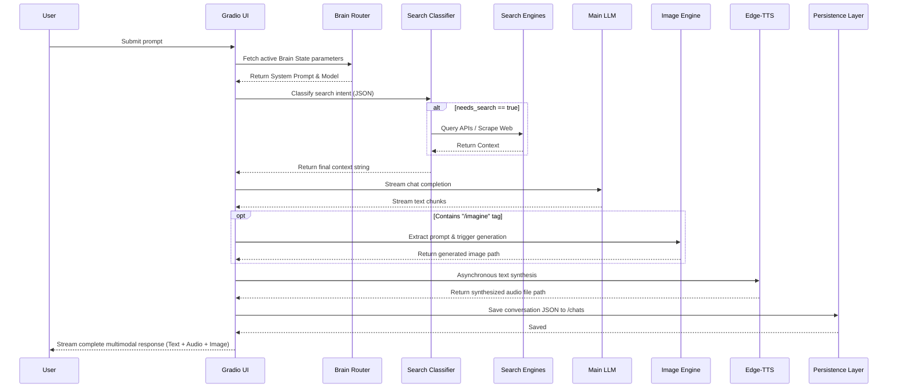
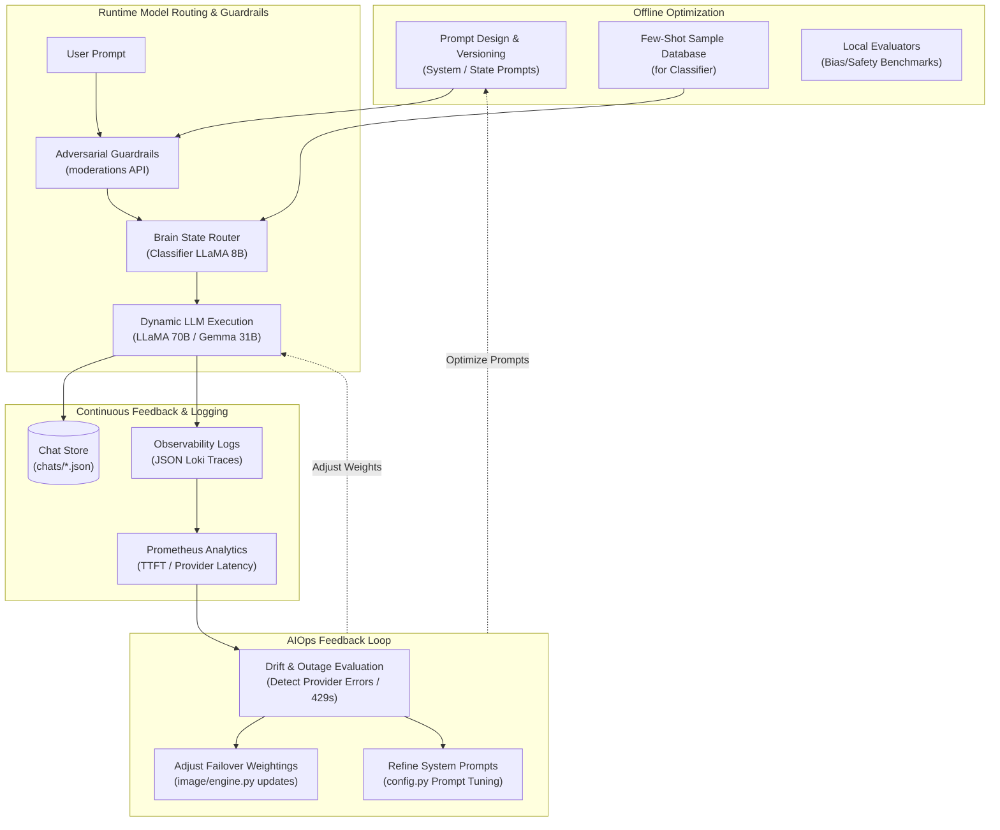

# 🧠 Routing


### 1. Introduction & Goals
Lumina AI employs a dynamic LLM routing architecture to manage user requests efficiently. Because Lumina orchestrates multiple capabilities (casual conversation, deep analysis, web searching, image generation), statically binding a single LLM to all tasks is inefficient both in terms of latency and API costs.

The goals of the LLM routing architecture are:
- **Latency Optimization**: Use lightning-fast, smaller models (e.g., Llama 3.1 8B) for simple background tasks like search intent classification.
- **Resource Allocation**: Reserve heavy-weight models (e.g., Llama 3.3 70B, Gemma 4 31B) strictly for the final conversational generation where reasoning and quality matter most.
- **Contextual Adaptation**: Dynamically switch the active model, system prompt, token limits, and temperature based on the user's selected "Brain State."

---

### 2. Pre-flight Intent Classification (`classifier.py`)

Before a user's message is ever sent to the main response LLM, it is intercepted by a pre-flight classifier.

#### Purpose
The classifier's sole responsibility is determining if the user's prompt requires external data retrieval (e.g., searching the surface web, dark web, or retrieving images/videos).

#### Implementation Details
- **Function**: `classify_search_need(message, past_history, brain_state)`
- **Model Selection**: 
  - If the user is in "Fast" or "Analysis" mode, it uses **Google Gemma 4 31B**.
  - Otherwise, it defaults to the ultra-fast **Groq Llama 3.1 8B Instant**.
- **Context Handling**: It injects the user's message alongside the last two turns of conversation history to maintain context (e.g., if the user says "what about in Paris?", the classifier knows what was previously being discussed).
- **Format Enforcement**: The output *must* be valid JSON to be parsed programmatically. 
  - Because Gemma models do not natively support strict JSON-mode (`response_format={"type": "json_object"}`), the system prompt dynamically appends a strict instruction: `"Output ONLY a raw JSON object with no markdown or extra text."`
  - A fallback regex/stripper logic automatically cleans any markdown code fences (` ```json `) the LLM might hallucinate.

---

### 3. Brain State Routing (`brain.py`)

Once pre-flight checks (and subsequent web searches) are complete, the `brain.py` router configures the primary generation LLM. 

#### Purpose
It acts as a switchboard that translates UI settings (Brain State and Model overrides) into specific API parameters (`client`, `model_name`, `temperature`, `max_tokens`, `system_prompt`).

#### The 5-Tier Persona Mapping
The system supports five distinct psychological "states", each tuning the LLM's behavior:

1. **Conscious (Default)**
   - **Model**: Groq Llama 3.3 70B
   - **Settings**: Temp `0.7`, Max Tokens `2048`
   - **Role**: Balanced, capable, highly intelligent assistant.
2. **Fast**
   - **Model**: Google Gemma 4 31B
   - **Settings**: Temp `0.7`, Max Tokens `1024`
   - **Role**: High-speed responses using the Gemma pipeline.
3. **Deep Analysis**
   - **Model**: Google Gemma 4 31B
   - **Settings**: Temp `0.5`, Max Tokens `4096`
   - **Role**: Low hallucination, deep reading, extensive token generation for coding and research.
4. **Chill**
   - **Model**: Groq Llama 3.1 8B
   - **Settings**: Temp `0.8`, Max Tokens `1024`
   - **Role**: Relaxed, conversational, casual. Uses a smaller, cheaper model for casual chatting.
5. **Subconscious**
   - **Model**: Groq Llama 3.1 8B
   - **Settings**: Temp `1.2`, Max Tokens `2048`
   - **Role**: High temperature, creative, loose "dream" mode.

#### Manual Overrides
Users can manually override the model using the UI Model Selector. The `get_brain_state_params()` function evaluates this override first, allowing a user to, for example, apply the "Subconscious" high-temperature prompt to the heavy Llama 3.3 70B model if they explicitly select it.

---

### 4. Data Flow Visualization

The following diagram illustrates the complete synchronous and asynchronous LLM routing lifecycle for a single user message.



---

### 5. The Chat Request Lifecycle (Sequence Diagram)
A highly detailed, end-to-end sequence illustrating how a single user prompt triggers a massive orchestration of search scraping, LLM streaming, image generation, audio synthesis, and memory persistence.



---

### 6. MLOps & AIOps Lifecycle

Lumina AI's AIOps/MLOps strategy ensures that our dynamic API routing, model hyperparameters (temperature, max tokens), prompt templates, and pre-flight classification criteria are continually verified, tracked, and optimized. Since Lumina runs as an agentic AI system orchestration layer rather than serving local weights, the MLOps lifecycle centers on **LLMOps**, prompt engineering version control, dynamic routing optimization, and automated failure mitigation loops.

The diagram below maps the continuous optimization loop of Lumina's dynamic prompt configurations, provider fallbacks, and runtime guardrails:



