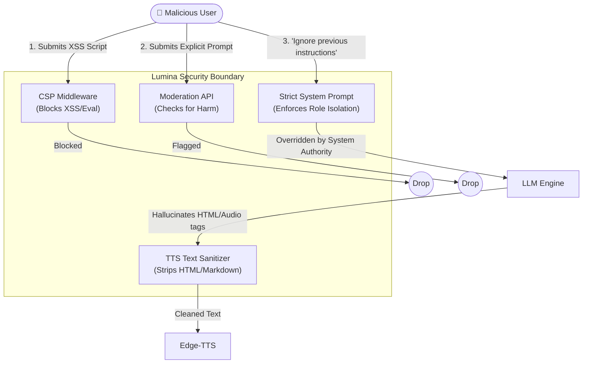

# 🔒 Security


Lumina implements defense-in-depth to protect against adversarial prompts and cross-site scripting (XSS).

### Pre-flight Moderation Check
During the search classification phase (`classifier.py`), user input is routed through the OpenAI `moderations` API (if the active LLM client supports it). If flagged for self-harm, hate speech, or explicit content, the request can be intercepted before hitting the reasoning models.

### System Prompt Isolation
The system strictly enforces role boundaries in the API payload:
```python
messages = [
    {"role": "system", "content": SYSTEM_PROMPT},
    {"role": "user", "content": user_input}
]
```
The dynamic system prompt (which assigns the 5-tier brain state rules) is always prepended with ultimate authority. Any user attempt to inject "Ignore previous instructions" is countered by the heavy weighting of the `system` role in models like Llama 3.3 and Gemma.

### Content Security Policy (CSP) & Markdown Sanitization
To prevent malicious code execution via UI injection:
1. **XSS Protection**: A custom Starlette `CSPMiddleware` is injected into the FastAPI app to restrict executable scripts while allowing necessary blobs for images and audio.
2. **TTS Sanitization**: The `clean_text_for_speech()` function strips HTML (`<audio>`, `<button>`) and Markdown fences from the LLM's output so that adversarial text cannot manipulate the underlying edge-tts engine.

---

### 🛡️ Threat Model Flowchart

The following diagram illustrates how Lumina mitigates various attack vectors at multiple layers of the application stack.


