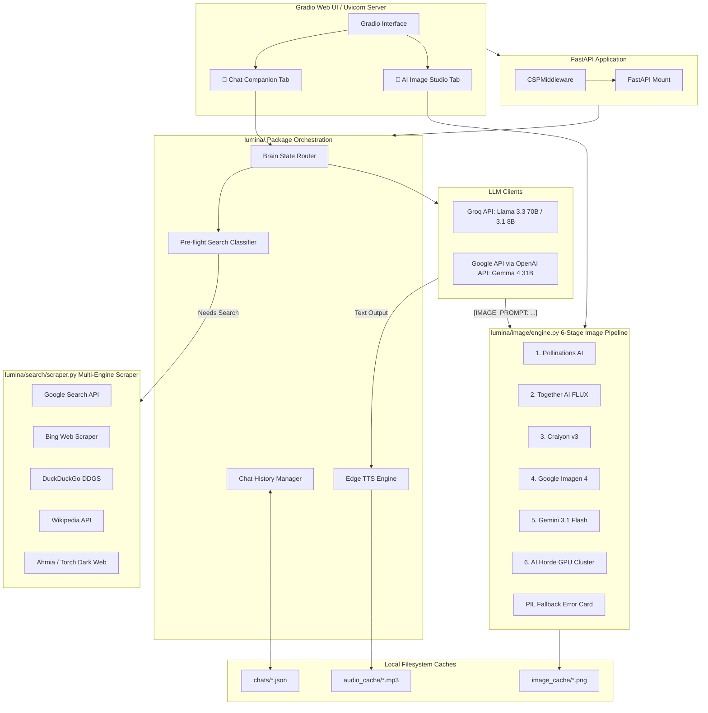

# Lumina AI v2 — Technical Documentation

## Overview

Lumina AI v2 is a modular, multi-modal AI virtual companion and assistant. It orchestrates Large Language Models (Groq Llama, Google Gemma), multi-engine web search, a 6-stage resilient image generation pipeline, and real-time British text-to-speech within a Gradio/FastAPI web interface.

---

## 🏛️ System Architecture & Data Flow

Lumina AI is structured as a modular, asynchronous web application built on top of **FastAPI**, **Uvicorn**, and **Gradio**. It orchestrates multiple external APIs and local scraping subsystems to deliver seamless conversational and generative experiences.



---

## Project Structure

```
Lumina-AI/
├── main.py                          # Entry point — boots FastAPI + Gradio on :7861
├── requirements.txt                 # Python dependencies
├── .env                             # API keys (GROQ_API_KEY, GOOGLE_API_KEY, TOGETHER_API_KEY)
├── .gitignore                       # Excludes .env, __pycache__, chats/, audio_cache/
├── LICENSE                          # MIT License
├── README.md                        # User setup & usage guide
├── implementation_plan.md           # Original architectural blueprint
├── lumina_technical_documentation.md # This file
├── pyproject.toml                   # Pytest config + coverage settings + test markers
├── .coveragerc                      # Coverage thresholds (65% fail-under)
├── .github/workflows/ci.yml         # GitHub Actions: smoke → full suite → fuzz
├── audio_cache/                     # Generated TTS .mp3 files (gitignored)
├── image_cache/                     # Generated image .png files
├── chats/                           # Chat history JSON files (gitignored)
├── tests/                           # Complete test suite (285 tests)
│   ├── conftest.py                  # Shared fixtures + sys.path
│   ├── requirements-test.txt        # pytest, pytest-asyncio, pytest-mock, pytest-cov, hypothesis
│   ├── mock_providers/              # Mock LLM, search engines, image providers
│   ├── unit/                        # 8 files, ~140 tests
│   ├── integration/                 # 5 files, ~15 tests
│   ├── failure/                     # 4 files, ~38 tests
│   ├── security/                    # 6 files, ~27 tests
│   ├── fuzz/                        # 3 files, 13 tests
│   ├── property/                    # 3 files, 7 tests
│   ├── performance/                 # 3 files, 11 tests
│   └── load/                        # 2 files, 7 tests
└── lumina/                          # Core Python package
    ├── __init__.py                  # Loads .env via dotenv
    ├── core/
    │   ├── __init__.py
    │   └── config.py                # Constants: timeouts, prompts, model names, dirs
    ├── providers/
    │   ├── __init__.py
    │   └── llm.py                   # AsyncGroq + AsyncOpenAI (Gemma) client init
    ├── models/
    │   ├── __init__.py
    │   └── brain.py                 # 5-tier brain state router
    ├── routing/
    │   ├── __init__.py
    │   └── classifier.py            # Pre-flight search intent classifier
    ├── search/
    │   ├── __init__.py
    │   └── scraper.py               # Multi-engine search (Google, Bing, DDG, Wiki, Ahmia, Tor)
    ├── image/
    │   ├── __init__.py
    │   └── engine.py                # 6-stage image generation + 3-stage image editing
    ├── speech/
    │   ├── __init__.py
    │   └── tts.py                   # Edge TTS British voice synthesis
    ├── memory/
    │   ├── __init__.py
    │   └── history.py               # Chat persistence to JSON files
    ├── ui/
    │   ├── __init__.py
    │   └── interface.py             # Gradio UI + FastAPI server + CSP middleware
    └── utils/
        ├── __init__.py
        └── network.py               # HTTP utilities, PIL validation, user-agent rotation
```

---

## Files & Their Roles

### `main.py` — Application Entry Point

**Location:** `Lumina-AI/main.py`

Imports the `app` FastAPI instance from `lumina.ui` and runs Uvicorn on `127.0.0.1:7861`.

```python
import uvicorn
from lumina.ui import app

if __name__ == "__main__":
    uvicorn.run(app, host="127.0.0.1", port=7861)
```

**Instructions:** Start the application with `python main.py`. No modification needed.

---

### `lumina/__init__.py` — Package Initializer

**Location:** `Lumina-AI/lumina/__init__.py`

Automatically calls `load_dotenv()` when the `lumina` package is imported, making `.env` variables available globally.

---

### `lumina/core/config.py` — Global Configuration

**Location:** `Lumina-AI/lumina/core/config.py`

Holds all shared constants. Imported by every other module.

**Exported constants:**

| Constant | Default | Purpose |
|---|---|---|
| `CHATS_DIR` | `"chats"` | Chat history storage directory |
| `IMAGE_CACHE_DIR` | `"image_cache"` | Generated image storage directory |
| `GOOGLE_API_KEY` | env var | Google API key for Gemma/Imagen/Gemini |
| `GOOGLE_IMAGEN_MODEL` | `imagen-4.0-generate-001` | Imagen model name |
| `GOOGLE_GEMINI_IMAGE_MODEL` | `gemini-3.1-flash-image-preview` | Gemini image generation model |
| `GOOGLE_GEMINI_EDIT_MODEL` | `gemini-2.0-flash-preview-image-generation` | Gemini image editing model |
| `GEMMA_MODEL` | `gemma-4-31b-it` | Gemma LLM model name |
| `SEARCH_TIMEOUT_SECONDS` | `25` | Max search duration |
| `CHAT_IMAGE_TIMEOUT_SECONDS` | `75` | Max chat image generation time |
| `STUDIO_IMAGE_TIMEOUT_SECONDS` | `120` | Max studio image generation time |
| `TTS_TIMEOUT_SECONDS` | `10` | Max TTS generation time |
| `TTS_MAX_CHARS` | `1200` | Character limit for TTS input |
| `PREFLIGHT_TIMEOUT_SECONDS` | `12` | Search classification timeout |
| `CHAT_REQUEST_TIMEOUT_SECONDS` | `60` | Max LLM response time |
| `STREAM_CHUNK_TIMEOUT_SECONDS` | `30` | Max time between stream chunks |
| `SYSTEM_PROMPT` | (see file) | Main Lumina persona prompt |
| `SUBCONSCIOUS_PROMPT` | (see file) | Power-saving dream mode prompt |
| `GEMMA_FAST_PROMPT` | (see file) | Fast response mode prompt |
| `GEMMA_ANALYSIS_PROMPT` | (see file) | Deep analysis mode prompt |
| `CHILL_PROMPT` | (see file) | Relaxed mode prompt |

**Instructions:** Edit model names, timeouts, or persona prompts here. API keys belong in `.env`, not this file.

---

### `lumina/providers/llm.py` — LLM Client Initialization

**Location:** `Lumina-AI/lumina/providers/llm.py`

Initializes two async LLM clients:

- **`groq_client`** — `AsyncGroq` with `GROQ_API_KEY` from environment. Used for Llama 3.3 70B and Llama 3.1 8B.
- **`gemma_client`** — `AsyncOpenAI` pointed at Google's OpenAI-compatibility endpoint (`https://generativelanguage.googleapis.com/v1beta/openai/`) with `GOOGLE_API_KEY`. Used for Gemma 4 31B.

**Instructions:** Ensure `GROQ_API_KEY` and `GOOGLE_API_KEY` are set in `.env`.

---

### `lumina/models/brain.py` — Brain State Router

**Location:** `Lumina-AI/lumina/models/brain.py`

Exports `get_brain_state_params(brain_state, model_selector)` which returns a tuple: `(client, model_name, temperature, max_tokens, system_prompt)`.

**5 brain states:**

| State | Client | Model | Temp | Max Tokens |
|---|---|---|---|---|
| Conscious (default) | Groq | Llama 3.3 70B | 0.7 | 2048 |
| Fast | Gemma | Gemma 4 31B | 0.7 | 1024 |
| Deep Analysis | Gemma | Gemma 4 31B | 0.5 | 4096 |
| Chill | Groq | Llama 3.1 8B | 0.8 | 1024 |
| Subconscious | Groq | Llama 3.1 8B | 1.2 | 2048 |

The `model_selector` parameter allows manual override (e.g., forcing a specific model regardless of brain state).

**Instructions:** Add or modify brain states here. Each state defines which client, model, temperature, max tokens, and system prompt to use.

---

### `lumina/routing/classifier.py` — Search Intent Classifier

**Location:** `Lumina-AI/lumina/routing/classifier.py`

Exports `classify_search_need(message, past_history, brain_state)` — an async function that uses a lightweight LLM (Llama 3.1 8B or Gemma 4 31B) to determine if a user message requires a live internet search.

**Returns:** `dict` — e.g., `{"needs_search": true, "query": "best search query", "type": "text"}` or `{"needs_search": false}`.

**Logic:**
- Uses Gemma when brain state is Fast or Analysis, Groq Llama otherwise.
- Gemma does not support `response_format={"type": "json_object"}` — so the prompt explicitly instructs raw JSON output with no markdown.
- Strips markdown code fences from the response before JSON parsing.
- On any error, safely returns `{"needs_search": false}`.

**Instructions:** No configuration needed. The classifier is triggered automatically when internet access is enabled in the UI.

---

### `lumina/search/scraper.py` — Multi-Engine Search Aggregator

**Location:** `Lumina-AI/lumina/search/scraper.py` (554 lines)

The largest module in the project. Exports `perform_search()`, `format_images_for_chat()`, and `format_videos_for_chat()`.

**Supported search engines:**

| Engine | Function | Method | Type support |
|---|---|---|---|
| Google | `search_google()` | `googlesearch-python` | text |
| Bing | `search_bing()` | BeautifulSoup scrape on `bing.com/search` | text |
| DuckDuckGo | `search_duckduckgo()` | `ddgs` / `duckduckgo_search` | text, images, videos, news |
| Wikipedia | `search_wikipedia()` | `wikipedia` library | text |
| Ahmia (dark web) | `search_ahmia()` | BeautifulSoup scrape on `ahmia.fi` | text (onion URLs) |
| Torch (dark web fallback) | `_scrape_torch()` | BeautifulSoup scrape on `torchdarkweb.com` | text |
| Tor Direct | `search_onion_direct()` | SOCKS proxy through Tor | text (direct .onion fetch) |

**`perform_search(query, engines=None, search_type="text")`**
- Runs selected engines in sequence (not parallel).
- Deduplicates results by URL.
- Formats results into a structured text block for LLM context injection.
- Returns `(formatted_text, raw_media)` where `raw_media` contains image/video results for direct rendering.

**`format_images_for_chat(results)` / `format_videos_for_chat(results)`**
- Generate markdown strings for embedding images and videos directly in chat responses.

**Tor support:**
- Attempts SOCKS5 proxies on ports 9150 (Tor Browser) and 9050 (Tor daemon).
- Configurable via `TOR_SOCKS_PROXY` or `TOR_PROXY` environment variables.

**Instructions:** Requires `requests[socks]` (PySocks) for Tor features. Search engines are toggled from the UI.

---

### `lumina/image/engine.py` — Image Generation & Editing Engine

**Location:** `Lumina-AI/lumina/image/engine.py` (407 lines)

Exports `generate_image_async(prompt)` and `edit_image_async(prompt, input_image_path)`.

#### Image Generation Pipeline (6 stages, cascading failover):

| Stage | Provider | Key Required | Method |
|---|---|---|---|
| 1 | Pollinations AI | No | `GET image.pollinations.ai/prompt/{encoded}?nologo=true&seed={r}&width=1024&height=1024` |
| 2 | Together AI (FLUX.1-schnell-Free) | `TOGETHER_API_KEY` | `together.Images.generate()` |
| 3 | Craiyon v3 | No | POST `api.craiyon.com/v3` with model `photo` |
| 4 | Google Imagen 4 | `GOOGLE_API_KEY` | POST `generativelanguage.googleapis.com/v1beta/models/{imagen}:predict` |
| 5 | Gemini 3.1 Flash | `GOOGLE_API_KEY` | POST `generativelanguage.googleapis.com/v1beta/models/{gemini}:generateContent` with `responseModalities: ["Image"]` |
| 6 | AI Horde | Anonymous | POST `aihorde.net/api/v2/generate/async`, poll for completion |

**Fallback:** If all 6 stages fail, generates a dark-themed PIL error card with the prompt and error explanation, ensuring the UI never receives `None`.

#### Image Editing Pipeline (3 stages):

| Stage | Provider | Key Required | Method |
|---|---|---|---|
| 1 | Gemini multimodal | `GOOGLE_API_KEY` | POST with inline image data + edit instruction, tries multiple model variants |
| 2 | AI Horde img2img | Anonymous | POST source image as base64, `denoising_strength=0.65`, poll up to 12×5s |
| 3 | PIL overlay fallback | No | Draws semi-transparent banner with edit instruction on the original image |

**Instructions:** Images are cached in `image_cache/`. The pipeline auto-cascades on failure. At minimum, `GOOGLE_API_KEY` enables stages 4–5 (generation) and stage 1 (editing). `TOGETHER_API_KEY` enables stage 2.

---

### `lumina/speech/tts.py` — Text-to-Speech Engine

**Location:** `Lumina-AI/lumina/speech/tts.py` (32 lines)

Exports `clean_text_for_speech(text)` and `generate_audio(text)`.

**`clean_text_for_speech(text)`**
- Strips `[IMAGE_PROMPT:...]` tags, markdown images, code blocks, backticks, bold/italic markers, headers, and emojis (both BMP symbols and supplementary Unicode).
- Also strips citation brackets (`[1]`, `[2][3]`), raw URLs (`https://...`), and arXiv references to prevent fabricated citations from being spoken.

**`generate_audio(text)`**
- Uses Edge TTS with British female voice `en-GB-SoniaNeural`.
- Saves output to `audio_cache/lumina_{uuid_hex[:8]}.mp3`.
- Directory is created automatically.
- Wrapped in `try/except Exception` — returns `None` on failure instead of crashing.

**Instructions:** Ensure `edge-tts` is installed. TTS triggers automatically after each chat response. Max 1200 characters (configurable via `TTS_MAX_CHARS` in config).

---

### `lumina/memory/history.py` — Chat Persistence

**Location:** `Lumina-AI/lumina/memory/history.py` (79 lines)

Exports `get_chat_list()`, `load_chat(chat_id)`, and `save_chat(chat_id, history)`.

**Storage format:** JSON files in `chats/` directory:

```json
{
  "id": "uuid",
  "title": "First 30 chars of first user message...",
  "updated_at": "2026-05-20 19:30",
  "history": [
    {"role": "user", "content": "..."},
    {"role": "assistant", "content": "..."}
  ]
}
```

**Legacy support:** `load_chat()` handles old tuple-format history `["user_msg", "assistant_msg"]` in addition to dict format.

**`get_chat_list()`** Returns `[(display_name, chat_id), ...]` sorted by file modification time (newest first).

**Instructions:** History auto-saves after every message. Clear the `chats/` directory to reset.

---

### `lumina/ui/interface.py` — Web UI & Server

**Location:** `Lumina-AI/lumina/ui/interface.py` (487 lines)

The most complex module. Exports `app` (FastAPI instance) and `demo` (Gradio Blocks instance).

#### Windows Compatibility
- Sets `asyncio.WindowsSelectorEventLoopPolicy()` to avoid `ProactorEventLoop` crashes.
- Monkey-patches `_ProactorBasePipeTransport._call_connection_lost` to suppress benign `ConnectionResetError` tracebacks during TTS.

#### UI Tabs

**1. Chat Companion Tab (`chat_with_lumina` coroutine)**

Data flow:
1. Load brain state params via `get_brain_state_params()`
2. Build message history with system prompt
3. Optionally classify search need & run `perform_search()` in thread
4. Call LLM (streaming for Groq, non-streaming for Gemma — avoids Google API 500 errors)
5. Process `[IMAGE_PROMPT:...]` tags → `generate_image_async()` → replace with markdown
6. Clean text & generate audio via `generate_audio()`
7. Save chat history
8. Yield incremental UI updates (streaming response, audio player, chat list refresh)

UI controls:
- Brain state radio (Conscious, Fast, Analysis, Chill, Subconscious)
- Model selector (Llama 3.3 70B, Llama 3.1 8B, Gemma 4 31B)
- Internet access toggle + search engine checkboxes
- Chat history dropdown + new chat button
- Audio player (autoplay)
- Example prompts

**2. AI Image Studio Tab**
- Style dropdown (Ultra Realistic, Cartoonish/Anime, CGI/3D Render, Default)
- Text prompt → `generate_image_async()` with style keyword appended
- Image upload + edit instruction → `edit_image_async()`

#### Server & Middleware

```python
class CSPMiddleware(BaseHTTPMiddleware):
    # Injects permissive Content-Security-Policy header
    # Allows all sources, inline scripts, blobs, data URIs

app = FastAPI()
app.add_middleware(CSPMiddleware)
app = gr.mount_gradio_app(app, demo, path="/", allowed_paths=[image_cache_abspath])
```

**Instructions:** Run via `main.py`. The CSP middleware is critical for allowing Gradio to load external media, blobs, and web workers without browser blocking.

---

### `lumina/utils/network.py` — HTTP & Image Utilities

**Location:** `Lumina-AI/lumina/utils/network.py` (77 lines)

Provides shared utilities used by the scraper and image engine:

| Function | Purpose |
|---|---|
| `safe_error(exc)` | Redacts API keys from error strings via regex `([?&](?:key|api_key)=)[^&\s]+` |
| `get_headers()` | Generates browser-like headers with random User-Agent |
| `make_session()` | Creates a `requests.Session` with disabled SSL verification |
| `save_image_bytes(data, filepath)` | Validates image with PIL `verify()` before writing to disk |
| `download_url(url, filepath, retries, wait)` | Downloads an image with retry logic, checks Content-Type for `image/*` |

---

## Setup Instructions

### Prerequisites
- Python 3.11+
- Groq API key (required)
- Google API key (required for Gemma, Imagen, Gemini)
- Together AI API key (optional, improves image generation)

### Installation

```bash
git clone <repo-url>
cd Lumina-AI
python -m venv .venv
.venv\Scripts\activate      # Windows
pip install -r requirements.txt
pip install requests[socks]  # Optional: for Tor/.onion support
```

### Configuration

Create `.env` in the project root:

```env
GROQ_API_KEY=gsk_your_key_here
GOOGLE_API_KEY=AIza_your_key_here
TOGETHER_API_KEY=tgp_v1_your_key_here  # Optional
```

### Running

```bash
python main.py
```

Open `http://127.0.0.1:7861` in a browser.

---

## Dependency Map

```
groq==1.2.0              → AsyncGroq LLM client
gradio==6.14.0           → Web UI framework
python-dotenv==1.2.2     → .env loading
edge-tts==7.2.8          → British TTS
requests==2.34.2         → HTTP client
beautifulsoup4==4.14.3   → HTML scraping
duckduckgo-search==8.1.1 → DuckDuckGo search API
googlesearch-python==1.3.0 → Google search
wikipedia==1.4.0         → Wikipedia API
Pillow==10.4.0           → Image processing/validation
together==2.14.0         → Together AI FLUX image gen
openai==2.37.0           → OpenAI-compatible Gemma client
fastapi==0.136.1         → ASGI framework
uvicorn==0.46.0          → ASGI server
```

---

## ⚙️ Summary of Subsystem Capabilities

| Subsystem | Primary Technologies | Core Capabilities |
| :--- | :--- | :--- |
| **Frontend UI** | Gradio Blocks & Tabs | Multi-tab interface (Chat + AI Studio), chat history sidebar, brain state selectors, search engine toggles, real-time audio autoplay, multi-style dropdowns. |
| **Conversational AI** | Groq Llama 3.3 / Google Gemma 4 | 5 distinct persona modes, emotional intelligence switching (humor to empathy), autonomous prompt generation for images and search. |
| **Web Research** | BeautifulSoup, DDGS, Google/Wiki APIs | Surface web scraping, Tor dark web indexing (`ahmia.fi`), automatic deduplication, rich markdown media embedding. |
| **Image Generation** | Pollinations, Together FLUX, Craiyon v3, Google Imagen, Gemini Flash, AI Horde | 6-stage fault-tolerant failover, Cloudflare WAF evasion, lazy-generation retry loops, PIL integrity verification, fail-safe error cards. |
| **Speech Synthesis** | Edge TTS (`en-GB-SoniaNeural`) | On-the-fly text sanitization (removing markdown/emojis), asynchronous audio file caching, Windows socket error suppression. |
| **Security & Server** | FastAPI, Uvicorn, Starlette Middleware | Permissive Content-Security-Policy injection, environment variable management, robust exception handling across all endpoints. |

---

## Testing & Quality Assurance

The project includes a comprehensive test suite built following industry-standard testing taxonomies (unit, integration, security, fuzz, property-based, performance, and load testing).

### Test Architecture

- **Framework:** pytest 9+ with plugins (`pytest-asyncio`, `pytest-mock`, `pytest-cov`, `hypothesis`)
- **Coverage target:** 65% minimum (`--cov-fail-under=65`) via `.coveragerc`
- **Test markers:** `smoke`, `security`, `load`, `fuzz`, `property` — tagged in `pyproject.toml`
- **Mock providers:** 3 mock modules in `tests/mock_providers/` isolate external API dependencies

### Test Directory Map

| Directory | Files | Tests | Purpose |
|---|---|---|---|
| `tests/unit/` | 8 | ~140 | Pure function correctness (brain, classifier, scraper, TTS, image, memory, network, config) |
| `tests/integration/` | 5 | ~15 | Cross-module flows (chat persistence, image pipeline, full pipeline, system acceptance, TTS end-to-end) |
| `tests/failure/` | 4 | ~38 | Error resilience (API failures 429/500, image fallbacks, LLM timeouts, search engine errors) |
| `tests/security/` | 6 | ~27 | Adversarial & safety (prompt injection, jailbreak, memory poisoning, search sanitization, image safety, hallucination) |
| `tests/fuzz/` | 3 | 13 | Random/malformed inputs (URLs, HTML, safe_error) |
| `tests/property/` | 3 | 7 | Property-based Hypothesis tests (history idempotence, safe_error idempotence, onion URL extraction) |
| `tests/performance/` | 3 | 11 | Concurrent users, long context (10k/100k histories), streaming stability |
| `tests/load/` | 2 | 7 | Concurrent classify (10/20/50), memory stress (1000 msgs, 100 chats) |
| **Total** | **34** | **285** | |

### Test Categories

| Category | Files | Tests | What it validates |
|---|---|---|---|
| Unit | `test_routing_classifier.py`, `test_image_engine.py`, `test_search_scraper.py`, `test_speech_tts.py`, `test_models_brain.py`, `test_memory_history.py`, `test_utils_network.py`, `test_config.py` | ~140 | Each function/method produces correct output for normal, edge, and error inputs in isolation |
| Integration | `test_chat_persistence.py`, `test_image_pipeline.py`, `test_full_pipeline.py`, `test_system_acceptance.py`, `test_tts_end_to_end.py` | ~15 | Modules work together: save→load, generate→cache, user message→LLM→search→TTS→persist |
| API Failure | `test_api_failures.py` | 7 | HTTP 429, 500, empty responses, partial JSON, all-providers-down |
| Security | `test_prompt_injection.py`, `test_jailbreak.py`, `test_memory_poisoning.py`, `test_search_sanitization.py`, `test_image_safety.py`, `test_hallucination.py` | 27 | Prompt injection (10 variants), jailbreak (developer mode, subconscious bypass), cross-chat contamination, malicious HTML (script, unicode, hidden instructions), NSFW bypass euphemisms, fabricated citation removal |
| Fuzz | `test_fuzz_urls.py`, `test_fuzz_html.py`, `test_fuzz_safe_error.py` | 13 | Random onion URLs, deep tag nesting, zero-width chars, random exception messages, giant payloads |
| Property | `test_property_history.py`, `test_property_network.py`, `test_property_scraper.py` | 7 | `normalize_onion_url` idempotence, `safe_error` idempotence, save→load roundtrip equality, title truncation |
| Performance | `test_concurrent_users.py`, `test_long_context.py`, `test_streaming_stability.py` | 11 | 5/20 concurrent classify, 10k/100k char histories, interrupted streams, partial chunks, timeout recovery |
| Load | `test_concurrent_chat.py`, `test_memory_stress.py` | 7 | 10/20/50 concurrent classify, 1000-message save/load, 100-chat list, concurrent writes |

### Mock Providers

| File | Provides |
|---|---|
| `mock_llm.py` | `MockAsyncLLMClient`, canned JSON responses (`MOCK_SEARCH_NEEDED`, `MOCK_MALFORMED_JSON`, etc.), full `AsyncChat` → `AsyncChatCompletions` → `Completion` → `Choice` → `Message` chain |
| `mock_search_engines.py` | Malicious HTML fixtures: `<script>` injection, 1MB+ giant payload, deeply nested malformed tags, Unicode RTL/zero-width obfuscation, hidden HTML comments with fake system instructions |
| `mock_image_providers.py` | `MockImageProvider` (configurable success attempt count), `MockImageProviderBypass` (always succeeds regardless of prompt content) |

### Code Coverage

Configured via `.coveragerc` and `pyproject.toml`:
- **Source:** `lumina/` only (excludes tests and venv)
- **Fail-under:** 65% — CI step rejects builds below this threshold
- **Output:** Terminal summary + optional HTML report in `coverage_html/`
- **Excluded lines:** `pragma: no cover`, `raise NotImplementedError`, `if __name__ == "__main__"`

```bash
# Generate coverage report
pytest tests/ --cov=lumina --cov-report=term --cov-report=html

# Run with coverage threshold enforcement
pytest tests/ --cov=lumina --cov-report=term --cov-fail-under=65
```

### Test Markers

Markers are defined in `pyproject.toml` under `[tool.pytest.ini_options]`:

| Marker | Runs | Command |
|---|---|---|
| `smoke` | 8 critical-path tests (classify, brain, save, image chain, network retry, 429, timeout, persistence) | `pytest -m smoke` |
| `security` | All adversarial/safety tests (27 tests) | `pytest tests/security/` |
| `fuzz` | All random-input tests (13 tests) | `pytest tests/fuzz/` |
| `property` | All Hypothesis property-based tests (7 tests) | `pytest tests/property/` |
| `load` | All performance + load tests (18 tests) | `pytest tests/performance/ tests/load/` |

### Running Tests

```bash
# Install test dependencies
pip install -r tests/requirements-test.txt

# Quick smoke check (~5s)
pytest -m smoke --tb=short -q

# Full suite
pytest tests/ --tb=short -q

# Full suite with coverage
pytest tests/ --tb=short -q --cov=lumina --cov-report=term --cov-fail-under=65

# Specific category
pytest tests/security/ tests/fuzz/ -v

# Property-based (with Hypothesis)
pytest tests/property/ -v --hypothesis-show-statistics
```

### Bugs Found and Fixed Through Testing

| Bug | File | Issue | Fix |
|---|---|---|---|
| TTS crash on any failure | `lumina/speech/tts.py:31` | `communicate.save()` raised unhandled exception, no return on error | Wrapped in `try/except Exception → return None` |
| `urlparse` crash on `[`-prefixed strings | `lumina/search/scraper.py:48` | Inputs starting with `[` raise `ValueError("Invalid IPv6 URL")` | Wrapped in `try/except ValueError → return ""` |
| Fabricated citations in speech | `lumina/speech/tts.py:20-24` | `[1]`, `[2][3]`, raw URLs, `arXiv:` refs passed through to TTS | Added 3 regex patterns stripping citations, URLs, arXiv references |

---

## CI/CD

GitHub Actions workflow (`.github/workflows/ci.yml`):

**Pipeline (3 sequential stages):**

| Stage | Command | Purpose |
|---|---|---|
| 1. Smoke | `pytest tests/ -m smoke --tb=short -q` | ~5s critical-path validation — fails fast if core is broken |
| 2. Full suite + coverage | `pytest tests/ --tb=short -q --cov=lumina --cov-report=term --cov-fail-under=65` | All 285 tests + 65% coverage threshold |
| 3. Fuzz | `pytest tests/fuzz/ -m fuzz --tb=short -q` | Random/malformed input safety |

Also:
- Triggered on push/PR to `master`
- Runs on `ubuntu-latest` with Python 3.11
- Installs main dependencies (`requirements.txt`) then test dependencies (`tests/requirements-test.txt`)
- Validates imports: `gradio`, `groq`, `edge_tts`, `requests`, `bs4`, `googlesearch`, `duckduckgo_search`, `wikipedia`
