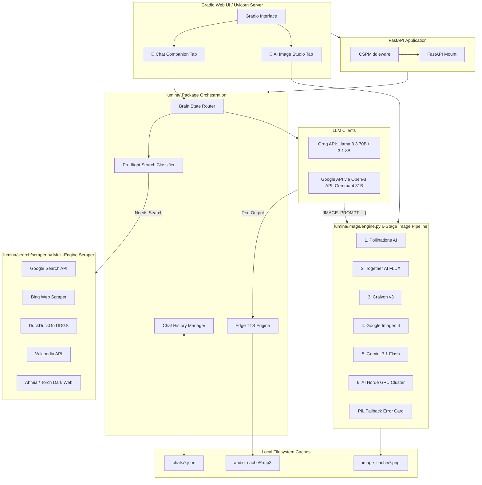
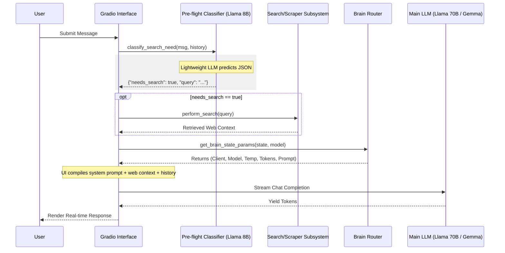
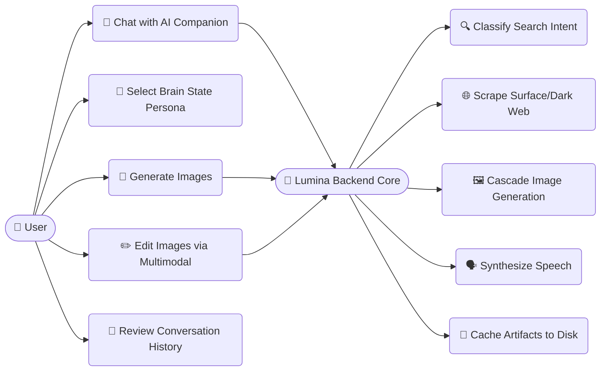
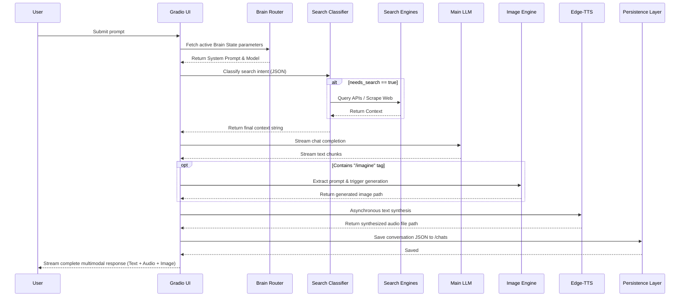
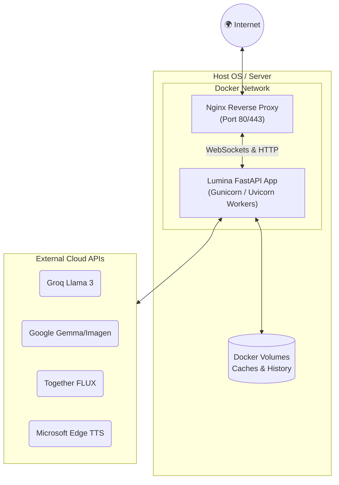

# Lumina AI v2 — Technical Documentation

## Overview

Lumina AI v2 is a modular, multi-modal AI virtual companion and assistant. It orchestrates Large Language Models (Groq Llama, Google Gemma), multi-engine web search, a 6-stage resilient image generation pipeline, and real-time British text-to-speech within a Gradio/FastAPI web interface.

---

## 🏛️ System Architecture & Data Flow

Lumina AI is structured as a modular, asynchronous web application built on top of **FastAPI**, **Uvicorn**, and **Gradio**. It orchestrates multiple external APIs and local scraping subsystems to deliver seamless conversational and generative experiences.



---

## Project Structure

```
Lumina-AI/
├── main.py                          # Entry point — boots FastAPI + Gradio on :7861
├── requirements.txt                 # Python dependencies
├── .env                             # API keys (GROQ_API_KEY, GOOGLE_API_KEY, TOGETHER_API_KEY)
├── .gitignore                       # Excludes .env, __pycache__, chats/, audio_cache/
├── LICENSE                          # MIT License
├── README.md                        # User setup & usage guide
├── implementation_plan.md           # Original architectural blueprint
├── lumina_technical_documentation.md # This file
├── .github/workflows/ci.yml         # GitHub Actions: import validation
├── audio_cache/                     # Generated TTS .mp3 files (gitignored)
├── image_cache/                     # Generated image .png files
├── chats/                           # Chat history JSON files (gitignored)
└── lumina/                          # Core Python package
    ├── __init__.py                  # Loads .env via dotenv
    ├── core/
    │   ├── __init__.py
    │   └── config.py                # Constants: timeouts, prompts, model names, dirs
    ├── providers/
    │   ├── __init__.py
    │   └── llm.py                   # AsyncGroq + AsyncOpenAI (Gemma) client init
    ├── models/
    │   ├── __init__.py
    │   └── brain.py                 # 5-tier brain state router
    ├── routing/
    │   ├── __init__.py
    │   └── classifier.py            # Pre-flight search intent classifier
    ├── search/
    │   ├── __init__.py
    │   └── scraper.py               # Multi-engine search (Google, Bing, DDG, Wiki, Ahmia, Tor)
    ├── image/
    │   ├── __init__.py
    │   └── engine.py                # 6-stage image generation + 3-stage image editing
    ├── speech/
    │   ├── __init__.py
    │   └── tts.py                   # Edge TTS British voice synthesis
    ├── memory/
    │   ├── __init__.py
    │   └── history.py               # Chat persistence to JSON files
    ├── ui/
    │   ├── __init__.py
    │   └── interface.py             # Gradio UI + FastAPI server + CSP middleware
    └── utils/
        ├── __init__.py
        └── network.py               # HTTP utilities, PIL validation, user-agent rotation
```

---

## Files & Their Roles

### `main.py` — Application Entry Point

**Location:** `Lumina-AI/main.py`

Imports the `app` FastAPI instance from `lumina.ui` and runs Uvicorn on `127.0.0.1:7861`.

```python
import uvicorn
from lumina.ui import app

if __name__ == "__main__":
    uvicorn.run(app, host="127.0.0.1", port=7861)
```

**Instructions:** Start the application with `python main.py`. No modification needed.

---

### `lumina/__init__.py` — Package Initializer

**Location:** `Lumina-AI/lumina/__init__.py`

Automatically calls `load_dotenv()` when the `lumina` package is imported, making `.env` variables available globally.

---

### `lumina/core/config.py` — Global Configuration

**Location:** `Lumina-AI/lumina/core/config.py`

Holds all shared constants. Imported by every other module.

**Exported constants:**

| Constant | Default | Purpose |
|---|---|---|
| `CHATS_DIR` | `"chats"` | Chat history storage directory |
| `IMAGE_CACHE_DIR` | `"image_cache"` | Generated image storage directory |
| `GOOGLE_API_KEY` | env var | Google API key for Gemma/Imagen/Gemini |
| `GOOGLE_IMAGEN_MODEL` | `imagen-4.0-generate-001` | Imagen model name |
| `GOOGLE_GEMINI_IMAGE_MODEL` | `gemini-3.1-flash-image-preview` | Gemini image generation model |
| `GOOGLE_GEMINI_EDIT_MODEL` | `gemini-2.0-flash-preview-image-generation` | Gemini image editing model |
| `GEMMA_MODEL` | `gemma-4-31b-it` | Gemma LLM model name |
| `SEARCH_TIMEOUT_SECONDS` | `25` | Max search duration |
| `CHAT_IMAGE_TIMEOUT_SECONDS` | `75` | Max chat image generation time |
| `STUDIO_IMAGE_TIMEOUT_SECONDS` | `120` | Max studio image generation time |
| `TTS_TIMEOUT_SECONDS` | `30` | Max TTS generation time |
| `TTS_MAX_CHARS` | `1200` | Character limit for TTS input |
| `PREFLIGHT_TIMEOUT_SECONDS` | `12` | Search classification timeout |
| `CHAT_REQUEST_TIMEOUT_SECONDS` | `60` | Max LLM response time |
| `STREAM_CHUNK_TIMEOUT_SECONDS` | `30` | Max time between stream chunks |
| `SYSTEM_PROMPT` | (see file) | Main Lumina persona prompt |
| `SUBCONSCIOUS_PROMPT` | (see file) | Power-saving dream mode prompt |
| `GEMMA_FAST_PROMPT` | (see file) | Fast response mode prompt |
| `GEMMA_ANALYSIS_PROMPT` | (see file) | Deep analysis mode prompt |
| `CHILL_PROMPT` | (see file) | Relaxed mode prompt |

**Instructions:** Edit model names, timeouts, or persona prompts here. API keys belong in `.env`, not this file.

---

### `lumina/providers/llm.py` — LLM Client Initialization

**Location:** `Lumina-AI/lumina/providers/llm.py`

Initializes two async LLM clients:

- **`groq_client`** — `AsyncGroq` with `GROQ_API_KEY` from environment. Used for Llama 3.3 70B and Llama 3.1 8B.
- **`gemma_client`** — `AsyncOpenAI` pointed at Google's OpenAI-compatibility endpoint (`https://generativelanguage.googleapis.com/v1beta/openai/`) with `GOOGLE_API_KEY`. Used for Gemma 4 31B.   

**Instructions:** Ensure `GROQ_API_KEY` and `GOOGLE_API_KEY` are set in `.env`.

---

### `lumina/models/brain.py` — Brain State Router

**Location:** `Lumina-AI/lumina/models/brain.py`

Exports `get_brain_state_params(brain_state, model_selector)` which returns a tuple: `(client, model_name, temperature, max_tokens, system_prompt)`.

**5 brain states:**

| State | Client | Model | Temp | Max Tokens |
|---|---|---|---|---|
| Conscious (default) | Groq | Llama 3.3 70B | 0.7 | 2048 |
| Fast | Gemma | Gemma 4 31B | 0.7 | 1024 |
| Deep Analysis | Gemma | Gemma 4 31B | 0.5 | 4096 |
| Chill | Groq | Llama 3.1 8B | 0.8 | 1024 |
| Subconscious | Groq | Llama 3.1 8B | 1.2 | 2048 |

The `model_selector` parameter allows manual override (e.g., forcing a specific model regardless of brain state).

**Instructions:** Add or modify brain states here. Each state defines which client, model, temperature, max tokens, and system prompt to use.

---

### `lumina/routing/classifier.py` — Search Intent Classifier

**Location:** `Lumina-AI/lumina/routing/classifier.py`

Exports `classify_search_need(message, past_history, brain_state)` — an async function that uses a lightweight LLM (Llama 3.1 8B or Gemma 4 31B) to determine if a user message requires a live internet search.

**Returns:** `dict` — e.g., `{"needs_search": true, "query": "best search query", "type": "text"}` or `{"needs_search": false}`.

**Logic:**
- Uses Gemma when brain state is Fast or Analysis, Groq Llama otherwise.
- Gemma does not support `response_format={"type": "json_object"}` — so the prompt explicitly instructs raw JSON output with no markdown.
- Strips markdown code fences from the response before JSON parsing.
- On any error, safely returns `{"needs_search": false}`.

**Instructions:** No configuration needed. The classifier is triggered automatically when internet access is enabled in the UI.

---

### `lumina/search/scraper.py` — Multi-Engine Search Aggregator

**Location:** `Lumina-AI/lumina/search/scraper.py` (554 lines)

The largest module in the project. Exports `perform_search()`, `format_images_for_chat()`, and `format_videos_for_chat()`.

**Supported search engines:**

| Engine | Function | Method | Type support |
|---|---|---|---|
| Google | `search_google()` | `googlesearch-python` | text |
| Bing | `search_bing()` | BeautifulSoup scrape on `bing.com/search` | text |
| DuckDuckGo | `search_duckduckgo()` | `ddgs` / `duckduckgo_search` | text, images, videos, news |
| Wikipedia | `search_wikipedia()` | `wikipedia` library | text |
| Ahmia (dark web) | `search_ahmia()` | BeautifulSoup scrape on `ahmia.fi` | text (onion URLs) |
| Torch (dark web fallback) | `_scrape_torch()` | BeautifulSoup scrape on `torchdarkweb.com` | text |
| Tor Direct | `search_onion_direct()` | SOCKS proxy through Tor | text (direct .onion fetch) |

**`perform_search(query, engines=None, search_type="text")`**
- Runs selected engines in sequence (not parallel).
- Deduplicates results by URL.
- Formats results into a structured text block for LLM context injection.
- Returns `(formatted_text, raw_media)` where `raw_media` contains image/video results for direct rendering.

**`format_images_for_chat(results)` / `format_videos_for_chat(results)`**
- Generate markdown strings for embedding images and videos directly in chat responses.

**Tor support:**
- Attempts SOCKS5 proxies on ports 9150 (Tor Browser) and 9050 (Tor daemon).
- Configurable via `TOR_SOCKS_PROXY` or `TOR_PROXY` environment variables.

**Instructions:** Requires `requests[socks]` (PySocks) for Tor features. Search engines are toggled from the UI.

---

### `lumina/image/engine.py` — Image Generation & Editing Engine

**Location:** `Lumina-AI/lumina/image/engine.py` (407 lines)

Exports `generate_image_async(prompt)` and `edit_image_async(prompt, input_image_path)`.

#### Image Generation Pipeline (6 stages, cascading failover):

| Stage | Provider | Key Required | Method |
|---|---|---|---|
| 1 | Pollinations AI | No | `GET image.pollinations.ai/prompt/{encoded}?nologo=true&seed={r}&width=1024&height=1024` |
| 2 | Together AI (FLUX.1-schnell-Free) | `TOGETHER_API_KEY` | `together.Images.generate()` |
| 3 | Craiyon v3 | No | POST `api.craiyon.com/v3` with model `photo` |
| 4 | Google Imagen 4 | `GOOGLE_API_KEY` | POST `generativelanguage.googleapis.com/v1beta/models/{imagen}:predict` |
| 5 | Gemini 3.1 Flash | `GOOGLE_API_KEY` | POST `generativelanguage.googleapis.com/v1beta/models/{gemini}:generateContent` with `responseModalities: ["Image"]` |
| 6 | AI Horde | Anonymous | POST `aihorde.net/api/v2/generate/async`, poll for completion |

**Fallback:** If all 6 stages fail, generates a dark-themed PIL error card with the prompt and error explanation, ensuring the UI never receives `None`.

#### Image Editing Pipeline (3 stages):

| Stage | Provider | Key Required | Method |
|---|---|---|---|
| 1 | Gemini multimodal | `GOOGLE_API_KEY` | POST with inline image data + edit instruction, tries multiple model variants |
| 2 | AI Horde img2img | Anonymous | POST source image as base64, `denoising_strength=0.65`, poll up to 12×5s |
| 3 | PIL overlay fallback | No | Draws semi-transparent banner with edit instruction on the original image |

**Instructions:** Images are cached in `image_cache/`. The pipeline auto-cascades on failure. At minimum, `GOOGLE_API_KEY` enables stages 4–5 (generation) and stage 1 (editing). `TOGETHER_API_KEY` enables stage 2.

---

### `lumina/speech/tts.py` — Text-to-Speech Engine

**Location:** `Lumina-AI/lumina/speech/tts.py` (32 lines)

Exports `clean_text_for_speech(text)` and `generate_audio(text)`.

**`clean_text_for_speech(text)`**
- Strips `[IMAGE_PROMPT:...]` tags, markdown images, code blocks, backticks, bold/italic markers, headers, and emojis (both BMP symbols and supplementary Unicode).
- Strips inline HTML tags (like `<audio>` and `<button>`) to prevent the TTS engine from reading UI markup.

**`generate_audio(text)`**
- Uses Edge TTS with dynamically selected voices (including 24 regional Arabic dialects).
- Saves output to `audio_cache/lumina_{uuid_hex[:8]}.mp3`.
- Directory is created automatically.

**Instructions:** Ensure `edge-tts` is installed. TTS triggers automatically after each chat response. Max 1200 characters (configurable via `TTS_MAX_CHARS` in config).

#### Supported Languages & Neural Voices
Lumina supports a vast array of high-fidelity neural voices. The LLM automatically detects the chosen language and accent, switching its persona, spelling, slang, and dialect dynamically.

**English Variations:**
- **British (UK):** Sonia (F), Libby (F), Maisie (F), Ryan (M), Thomas (M)
- **American (US):** Aria (F), Jenny (F), Emma (F), Guy (M), Andrew (M)
- **Australian (AU):** Natasha (F), William (M)
- **Canadian (CA):** Clara (F), Liam (M)
- **Indian (IN):** Neerja (F), Prabhat (M)
- **Irish (IE):** Emily (F), Connor (M)
- **New Zealander (NZ):** Molly (F), Mitchell (M)
- **South African (ZA):** Leah (F), Luke (M)
- **Singaporean (SG):** Luna (F), Wayne (M)
- **Philippine (PH):** Rosa (F), James (M)
- **Hong Kong (HK):** Yan (F), Sam (M)
- **Kenyan (KE):** Asilia (F), Chilemba (M)
- **Nigerian (NG):** Ezinne (F), Abeo (M)
- **Tanzanian (TZ):** Imani (F), Elimu (M)

**Arabic Dialects:**
- **Egypt (EG):** Salma (F), Shakir (M)
- **Saudi Arabia (SA):** Zariyah (F), Hamed (M)
- **UAE (AE):** Fatima (F), Hamdan (M)
- **Lebanon (LB):** Layla (F), Rami (M)
- **Jordan (JO):** Sana (F), Taim (M)
- **Syria (SY):** Amany (F), Laith (M)
- **Algeria (DZ):** Amina (F), Ismael (M)
- **Morocco (MA):** Mouna (F), Jamal (M)
- **Tunisia (TN):** Reem (F), Hedi (M)
- **Iraq (IQ):** Rana (F), Bassel (M)
- **Kuwait (KW):** Noura (F), Fahed (M)
- **Qatar (QA):** Amal (F), Moaz (M)

**European & Asian Languages:**
- **Spanish (Spain):** Elvira (F), Alvaro (M)
- **Spanish (Mexico):** Dalia (F), Jorge (M)
- **French (France):** Denise (F), Vivienne (F), Henri (M)
- **French (Canada):** Sylvie (F), Antoine (M)
- **German:** Amala (F), Seraphina (F), Killian (M)
- **Italian:** Elsa (F), Diego (M)
- **Portuguese (Brazil):** Francisca (F), Antonio (M)
- **Portuguese (Portugal):** Raquel (F), Duarte (M)
- **Russian:** Svetlana (F), Dmitry (M)
- **Japanese:** Nanami (F), Keita (M)
- **Chinese (Mandarin):** Xiaoxiao (F), Yunxi (M)
- **Hindi:** Swara (F), Madhur (M)

---

### `lumina/memory/history.py` — Chat Persistence

**Location:** `Lumina-AI/lumina/memory/history.py` (79 lines)

Exports `get_chat_list()`, `load_chat(chat_id)`, and `save_chat(chat_id, history)`.

**Storage format:** JSON files in `chats/` directory:

```json
{
  "id": "uuid",
  "title": "First 30 chars of first user message...",
  "updated_at": "2026-05-20 19:30",
  "history": [
    {"role": "user", "content": "..."},
    {"role": "assistant", "content": "..."}
  ]
}
```

**Legacy support:** `load_chat()` handles old tuple-format history `["user_msg", "assistant_msg"]` in addition to dict format.

**`get_chat_list()`** Returns `[(display_name, chat_id), ...]` sorted by file modification time (newest first).

**Instructions:** History auto-saves after every message. Clear the `chats/` directory to reset.

---

### `lumina/ui/interface.py` — Web UI & Server

**Location:** `Lumina-AI/lumina/ui/interface.py` (487 lines)

The most complex module. Exports `app` (FastAPI instance) and `demo` (Gradio Blocks instance).

#### Windows Compatibility
- Sets `asyncio.WindowsSelectorEventLoopPolicy()` to avoid `ProactorEventLoop` crashes.
- Monkey-patches `_ProactorBasePipeTransport._call_connection_lost` to suppress benign `ConnectionResetError` tracebacks during TTS.

#### UI Tabs

**1. Chat Companion Tab (`chat_with_lumina` coroutine)**

Data flow:
1. Load brain state params via `get_brain_state_params()`
2. Build message history with system prompt (automatically applies regional dialects/slang based on the selected voice accent, e.g., Egyptian or Lebanese Arabic).
3. Optionally classify search need & run `perform_search()` in thread
4. Call LLM (streaming for Groq, non-streaming for Gemma — avoids Google API 500 errors)
5. Process `[IMAGE_PROMPT:...]` tags → `generate_image_async()` → replace with markdown
6. Clean text & generate audio via `generate_audio()`
7. Inject an inline HTML `<audio>` player with a custom styled "Play" button directly into the chat stream using relative paths to bypass strict Gradio `allowed_paths` checks.
8. Save chat history
9. Yield incremental UI updates (streaming response, audio player, chat list refresh)

**Robust Parsing Helper:** Uses a recursive `extract_text_content()` function to extract strings from nested Gradio message structures (lists, tuples, `FileData` dicts) to prevent type errors.

UI controls:
- Brain state radio (Conscious, Fast, Analysis, Chill, Subconscious)
- Model selector (Llama 3.3 70B, Llama 3.1 8B, Gemma 4 31B)
- Internet access toggle + search engine checkboxes
- Chat history dropdown + new chat button
- Audio player (autoplay)
- Example prompts

**2. AI Image Studio Tab**
- Style dropdown (Ultra Realistic, Cartoonish/Anime, CGI/3D Render, Default)
- Text prompt → `generate_image_async()` with style keyword appended
- Image upload + edit instruction → `edit_image_async()`

#### Server & Middleware

```python
class CSPMiddleware(BaseHTTPMiddleware):
    # Injects permissive Content-Security-Policy header
    # Allows all sources, inline scripts, blobs, data URIs

app = FastAPI()
app.add_middleware(CSPMiddleware)
app = gr.mount_gradio_app(app, demo, path="/", allowed_paths=[image_cache_abspath])
```

**Instructions:** Run via `main.py`. The CSP middleware is critical for allowing Gradio to load external media, blobs, and web workers without browser blocking.

---

### `lumina/utils/network.py` — HTTP & Image Utilities

**Location:** `Lumina-AI/lumina/utils/network.py` (77 lines)

Provides shared utilities used by the scraper and image engine:

| Function | Purpose |
|---|---|
| `safe_error(exc)` | Redacts API keys from error strings via regex `([?&](?:key|api_key)=)[^&\s]+` |
| `get_headers()` | Generates browser-like headers with random User-Agent |
| `make_session()` | Creates a `requests.Session` with disabled SSL verification |
| `save_image_bytes(data, filepath)` | Validates image with PIL `verify()` before writing to disk |
| `download_url(url, filepath, retries, wait)` | Downloads an image with retry logic, checks Content-Type for `image/*` |

---

## Setup Instructions

### Prerequisites
- Python 3.11+
- Groq API key (required)
- Google API key (required for Gemma, Imagen, Gemini)
- Together AI API key (optional, improves image generation)

### Installation

```bash
git clone <repo-url>
cd Lumina-AI
python -m venv .venv
.venv\Scripts\activate      # Windows
pip install -r requirements.txt
pip install requests[socks]  # Optional: for Tor/.onion support
```

### Configuration

Create `.env` in the project root:

```env
GROQ_API_KEY=gsk_your_key_here
GOOGLE_API_KEY=AIza_your_key_here
TOGETHER_API_KEY=tgp_v1_your_key_here  # Optional
```

### Running (Local Development)

```bash
python main.py
```

Open `http://127.0.0.1:7861` in a browser.

### Production Deployment (Docker)

Lumina includes a fully containerized production infrastructure utilizing Docker, Gunicorn, and Nginx.

**Infrastructure Components:**
- **Dockerfile**: Builds a lightweight Python 3.11 image and installs all dependencies.
- **Production Server**: Uses **Gunicorn** with asynchronous **Uvicorn** workers to handle high-concurrency requests and robust application scaling.
- **Reverse Proxy (Nginx)**: The included `nginx/nginx.conf` securely routes traffic to the backend on port 80, explicitly handling WebSocket upgrades required by Gradio.
- **docker-compose.yml**: Orchestrates the Nginx reverse proxy and the Lumina Python backend, automatically mounting persistent volumes for image and audio caches.
- **Environment Separation**:
  - `.env.dev`: Local development environment variables template.
  - `.env.prod`: Production environment variables explicitly loaded by Docker Compose.

**Deployment Steps:**
1. Populate `.env.prod` with your real API keys.
2. Run the following command to build the image and spin up the backend and reverse proxy in the background:

```bash
docker-compose up -d --build
```
3. Access the application on `http://<your-server-ip>/`.

---

## Dependency Map

```
groq==1.2.0              → AsyncGroq LLM client
gradio==6.14.0           → Web UI framework
python-dotenv==1.2.2     → .env loading
edge-tts==7.2.8          → British TTS
requests==2.34.2         → HTTP client
beautifulsoup4==4.14.3   → HTML scraping
duckduckgo-search==8.1.1 → DuckDuckGo search API
googlesearch-python==1.3.0 → Google search
wikipedia==1.4.0         → Wikipedia API
Pillow==10.4.0           → Image processing/validation
together==2.14.0         → Together AI FLUX image gen
openai==2.37.0           → OpenAI-compatible Gemma client
fastapi==0.136.1         → ASGI framework
uvicorn==0.46.0          → ASGI server
```

---

## ⚙️ Summary of Subsystem Capabilities

| Subsystem | Primary Technologies | Core Capabilities |
| :--- | :--- | :--- |
| **Conversational AI** | Groq Llama 3.3 / Google Gemma 4 | 5 distinct persona modes, emotional intelligence switching, autonomous prompt generation, and dynamic dialect switching based on TTS accent. |
| **Web Research** | BeautifulSoup, DDGS, Google/Wiki APIs | Surface web scraping, Tor dark web indexing (`ahmia.fi`), automatic deduplication, rich markdown media embedding. |
| **Image Generation** | Pollinations, Together FLUX, Craiyon v3, Google Imagen, Gemini Flash, AI Horde | 6-stage fault-tolerant failover, Cloudflare WAF evasion, lazy-generation retry loops, PIL integrity verification, fail-safe error cards. |
| **Speech Synthesis** | Edge TTS | 24+ regional accents, inline chat HTML play buttons, on-the-fly text/HTML sanitization, asynchronous caching, Windows socket error suppression. |
| **Security & Server** | FastAPI, Uvicorn, Starlette Middleware | Permissive Content-Security-Policy injection, robust relative path handling for static files, environment variable management, and comprehensive error handling. |

---

## CI/CD

GitHub Actions workflow (`.github/workflows/ci.yml`):
- Triggered on push/PR to `master`
- Runs on `ubuntu-latest` with Python 3.11
- Installs dependencies from `requirements.txt`
- Validates imports: `gradio`, `groq`, `edge_tts`, `requests`, `bs4`, `googlesearch`, `duckduckgo_search`, `wikipedia`

---

## 🧠 LLM Routing Architecture

### 1. Introduction & Goals
Lumina AI employs a dynamic LLM routing architecture to manage user requests efficiently. Because Lumina orchestrates multiple capabilities (casual conversation, deep analysis, web searching, image generation), statically binding a single LLM to all tasks is inefficient both in terms of latency and API costs.

The goals of the LLM routing architecture are:
- **Latency Optimization**: Use lightning-fast, smaller models (e.g., Llama 3.1 8B) for simple background tasks like search intent classification.
- **Resource Allocation**: Reserve heavy-weight models (e.g., Llama 3.3 70B, Gemma 4 31B) strictly for the final conversational generation where reasoning and quality matter most.
- **Contextual Adaptation**: Dynamically switch the active model, system prompt, token limits, and temperature based on the user's selected "Brain State."

---

### 2. Pre-flight Intent Classification (`classifier.py`)

Before a user's message is ever sent to the main response LLM, it is intercepted by a pre-flight classifier.

#### Purpose
The classifier's sole responsibility is determining if the user's prompt requires external data retrieval (e.g., searching the surface web, dark web, or retrieving images/videos).

#### Implementation Details
- **Function**: `classify_search_need(message, past_history, brain_state)`
- **Model Selection**: 
  - If the user is in "Fast" or "Analysis" mode, it uses **Google Gemma 4 31B**.
  - Otherwise, it defaults to the ultra-fast **Groq Llama 3.1 8B Instant**.
- **Context Handling**: It injects the user's message alongside the last two turns of conversation history to maintain context (e.g., if the user says "what about in Paris?", the classifier knows what was previously being discussed).
- **Format Enforcement**: The output *must* be valid JSON to be parsed programmatically. 
  - Because Gemma models do not natively support strict JSON-mode (`response_format={"type": "json_object"}`), the system prompt dynamically appends a strict instruction: `"Output ONLY a raw JSON object with no markdown or extra text."`
  - A fallback regex/stripper logic automatically cleans any markdown code fences (` ```json `) the LLM might hallucinate.

---

### 3. Brain State Routing (`brain.py`)

Once pre-flight checks (and subsequent web searches) are complete, the `brain.py` router configures the primary generation LLM. 

#### Purpose
It acts as a switchboard that translates UI settings (Brain State and Model overrides) into specific API parameters (`client`, `model_name`, `temperature`, `max_tokens`, `system_prompt`).

#### The 5-Tier Persona Mapping
The system supports five distinct psychological "states", each tuning the LLM's behavior:

1. **Conscious (Default)**
   - **Model**: Groq Llama 3.3 70B
   - **Settings**: Temp `0.7`, Max Tokens `2048`
   - **Role**: Balanced, capable, highly intelligent assistant.
2. **Fast**
   - **Model**: Google Gemma 4 31B
   - **Settings**: Temp `0.7`, Max Tokens `1024`
   - **Role**: High-speed responses using the Gemma pipeline.
3. **Deep Analysis**
   - **Model**: Google Gemma 4 31B
   - **Settings**: Temp `0.5`, Max Tokens `4096`
   - **Role**: Low hallucination, deep reading, extensive token generation for coding and research.
4. **Chill**
   - **Model**: Groq Llama 3.1 8B
   - **Settings**: Temp `0.8`, Max Tokens `1024`
   - **Role**: Relaxed, conversational, casual. Uses a smaller, cheaper model for casual chatting.
5. **Subconscious**
   - **Model**: Groq Llama 3.1 8B
   - **Settings**: Temp `1.2`, Max Tokens `2048`
   - **Role**: High temperature, creative, loose "dream" mode.

#### Manual Overrides
Users can manually override the model using the UI Model Selector. The `get_brain_state_params()` function evaluates this override first, allowing a user to, for example, apply the "Subconscious" high-temperature prompt to the heavy Llama 3.3 70B model if they explicitly select it.

---

### 4. Data Flow Visualization

The following diagram illustrates the complete synchronous and asynchronous LLM routing lifecycle for a single user message.



---

## 🛡️ Multimodal Failover Design

Lumina achieves high availability through deep fallback cascades. By utilizing a "try-except chain", the system guarantees a response even when third-party APIs experience downtime or rate-limit blocks.

### Image Generation Failover (6-Stage)
If the primary image generator fails, the `generate_image_async()` function automatically cascades down to the next provider:
1. **Pollinations AI**: Extremely fast, no authentication required.
2. **Together AI (FLUX)**: High-quality models using `TOGETHER_API_KEY`.
3. **Craiyon v3**: Web scraping-based fallback using custom headers.
4. **Google Imagen 4**: High-fidelity authenticated generation.
5. **Gemini 3.1 Flash**: Multimodal content generation fallback.
6. **AI Horde**: A crowdsourced, anonymous GPU cluster (polls for completion).

If all 6 providers fail, the system **never crashes**. Instead, it generates a fallback PIL (Python Imaging Library) error card locally, rendering the prompt and a generic "API Unavailable" message so the user interface remains stable.

### Audio and Search Failovers
- **TTS**: Handled via `edge-tts`. If the websocket connection to Microsoft drops, the `TTS_TIMEOUT_SECONDS` config catches the timeout, safely suppressing the error so the text response still renders for the user.
- **Search Engine Scrapers**: If `googlesearch-python` triggers a 429 Rate Limit, Lumina automatically falls back to DuckDuckGo (`ddgs`), and subsequently Wikipedia. For Dark Web searches, it attempts Ahmia first, and falls back to Torch if `.onion` indexing is blocked.

---

## 🔒 Prompt Injection Threat Model

Lumina implements defense-in-depth to protect against adversarial prompts and cross-site scripting (XSS).

### Pre-flight Moderation Check
During the search classification phase (`classifier.py`), user input is routed through the OpenAI `moderations` API (if the active LLM client supports it). If flagged for self-harm, hate speech, or explicit content, the request can be intercepted before hitting the reasoning models.

### System Prompt Isolation
The system strictly enforces role boundaries in the API payload:
```python
messages = [
    {"role": "system", "content": SYSTEM_PROMPT},
    {"role": "user", "content": user_input}
]
```
The dynamic system prompt (which assigns the 5-tier brain state rules) is always prepended with ultimate authority. Any user attempt to inject "Ignore previous instructions" is countered by the heavy weighting of the `system` role in models like Llama 3.3 and Gemma.

### Content Security Policy (CSP) & Markdown Sanitization
To prevent malicious code execution via UI injection:
1. **XSS Protection**: A custom Starlette `CSPMiddleware` is injected into the FastAPI app to restrict executable scripts while allowing necessary blobs for images and audio.
2. **TTS Sanitization**: The `clean_text_for_speech()` function strips HTML (`<audio>`, `<button>`) and Markdown fences from the LLM's output so that adversarial text cannot manipulate the underlying edge-tts engine.

---

## 🌌 Distributed Image Pipeline

The `lumina/image/engine.py` orchestrates a decentralized approach to image synthesis.

### Pipeline Architecture
- **Asynchronous Execution**: Because image generation can take anywhere from 3 seconds (Pollinations) to 2 minutes (AI Horde queue), the entire failover chain is wrapped in `asyncio.to_thread()`. This prevents the slow synchronous HTTP requests (`requests.Session().post`) from blocking Gradio's main asynchronous event loop.
- **Image Editing (img2img)**: For the "AI Image Studio" tab, Lumina performs a 3-stage edit fallback:
  1. **Gemini Multimodal**: Passes the base64-encoded image and text instruction directly to the `gemini-2.0-flash` vision model.
  2. **AI Horde (img2img)**: Resizes the source image, applies `denoising_strength=0.65`, and polls the distributed GPU workers.
  3. **PIL Overlay**: If both fail, Lumina draws a semi-transparent banner natively over the original image detailing the prompt, ensuring the user gets *some* visual feedback.

---

## 💾 Memory Persistence Design

Chat history in Lumina is designed to be persistent, portable, and fault-tolerant.

### History Serialization (`history.py`)
All conversations are saved as JSON blobs in the `chats/` directory.

- **Data Structure**:
```json
{
  "id": "uuid4",
  "title": "Explain quantum physics...",
  "updated_at": "2026-05-22 14:30",
  "history": [
    {"role": "user", "content": "Explain quantum physics"},
    {"role": "assistant", "content": "Quantum physics is..."}
  ]
}
```

### Auto-Titling and Flattening
- **Title Generation**: `save_chat()` automatically extracts the very first user message, converts it to a string, and truncates it to 30 characters to dynamically name the chat session in the UI sidebar.
- **Robust Parsing**: Gradio 4+ occasionally returns history as tuples (`(user_msg, bot_msg)`) or nested `FileData` dictionaries (when users upload images). The `extract_text_content()` recursive helper flattens these complex structures into clean strings before they are serialized to JSON or sent to the TTS engine.

---

## 🤝 Open-Source Collaboration & Repository Management

Lumina AI is structured to support seamless open-source contributions and transparent project management.

### Foundational Documents
- **`CONTRIBUTING.md`**: Outlines the standard operating procedures for external developers, including how to fork, configure environment variables, run locally, and adhere to our branching strategy (`feature/` vs `bugfix/`).
- **`ROADMAP.md`**: Provides a clear, tiered outlook on the project's future, broken down into Near Term (Vector Databases), Medium Term (Agentic Actions), and Long Term (Autonomous capabilities).
- **`CHANGELOG.md`**: Adheres to the "Keep a Changelog" format to historically track major features, architectural pivots, and bug fixes across semantic versions.
- **`VERSION`**: A strict semantic versioning file (currently `2.0.0`) tracking the overarching build state.

### Automated GitHub Workflows
The repository utilizes standardized `.github` templates to enforce high-quality issue tracking and pull requests:
1. **Bug Reports (`.github/ISSUE_TEMPLATE/bug_report.md`)**: Mandates that reporters include reproducible steps, OS environment, Python version, and crash logs.
2. **Feature Requests (`.github/ISSUE_TEMPLATE/feature_request.md`)**: Prompts users to define the problem their feature solves rather than just the feature itself.
3. **Pull Request Validation (`.github/PULL_REQUEST_TEMPLATE.md`)**: Enforces a checklist (documentation updates, self-reviews, manual testing) before any code is merged into the `master` branch.

---

## 📊 Comprehensive Architectural Diagrams

The following diagrams illustrate the high-level interactions, the internal orchestration, the complete request lifecycle, and the production deployment architecture of Lumina AI.

### 1. System-Wide Use Case Diagram
This diagram illustrates the primary actions a human user can take and how those actions connect to the autonomous orchestration handled by the Lumina Backend Core.



### 3. The Chat Request Lifecycle (Sequence Diagram)
A highly detailed, end-to-end sequence illustrating how a single user prompt triggers a massive orchestration of search scraping, LLM streaming, image generation, audio synthesis, and memory persistence.



### 4. Deployment Diagram
Illustrates the production-ready Docker infrastructure, showcasing how traffic hits the reverse proxy before being distributed to Uvicorn workers.


